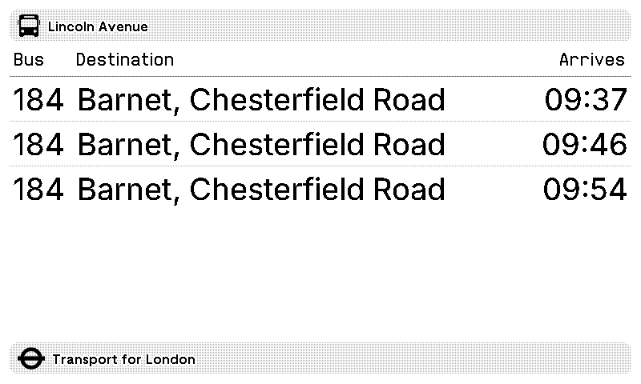

# TRMNL plugins

Recipe plugins for [TRMNL](https://usetrmnl.com) e-ink displays.

## TfL Bus Stops

Live bus arrival times from Transport for London. Polls the TfL API every 5 minutes and shows the next buses at your stop, sorted by arrival time.



Works across all four TRMNL layout sizes (full, half horizontal, half vertical, quadrant).

### Setup

1. In the TRMNL recipe editor, create a new recipe using the files in `tfl_bus_times/`
2. Set the `stoppoint` custom field to your TfL StopPoint ID
3. To find your StopPoint ID: search for your bus stop on the [TfL website](https://tfl.gov.uk) and grab the code from the URL

### Files

```
tfl_bus_times/
  settings.yml          # API config and custom fields
  shared.liquid         # Sorts buses by arrival time
  full.liquid           # Full-screen layout
  half_horizontal.liquid
  half_vertical.liquid
  quadrant.liquid
```

### Data source

Uses the [TfL Unified API](https://api.tfl.gov.uk/) (free, no key required). Not affiliated with TfL.

## National Rail Departures

Live train departures from any National Rail station, with platform and status. Optionally show only trains that call at a second station, which works as a "towards work" filter. Station disruption notices appear under the table, or replace it when nothing is running.

Works across all four TRMNL layout sizes.

### Setup

1. Register at [Rail Data Marketplace](https://raildata.org.uk).
2. Subscribe to the free [Live Departure Board](https://raildata.org.uk/dashboard/dataProduct/P-d81d6eaf-8060-4467-a339-1c833e50cbbe/overview) data product.
3. Copy the consumer key from the product's Specification tab.
4. In the TRMNL recipe editor, create a new recipe using the files in `national_rail_departures/`.
5. Set the `api_key`, `crs` (your station, for example `WIM`), and optionally `filter_crs` (a station the train must call at, for example `WAT`).

If the endpoint URL shown in the Specification tab differs from the one in `settings.yml`, replace it.

### Files

```
national_rail_departures/
  settings.yml          # API config and custom fields
  shared.liquid         # Normalises the payload and defines the shared board template
  full.liquid           # Full-screen layout
  half_horizontal.liquid
  half_vertical.liquid
  quadrant.liquid
  check.py              # Local render check: python3 check.py (needs python-liquid)
```

### Data source

Uses the Live Departure Board product on [Rail Data Marketplace](https://raildata.org.uk), a JSON wrapper over National Rail's Darwin feed. Data is provided by Rail Delivery Group and requires attribution. Not affiliated with National Rail or Rail Delivery Group.

## Framework cheat sheet

`TRMNL_FRAMEWORK_CHEAT_SHEET.md` is a complete reference of every CSS class in the TRMNL framework v2. Useful if you're building your own plugins or if you're an AI agent helping someone build one. Compiled from the [official docs](https://trmnl.com/framework/docs).
